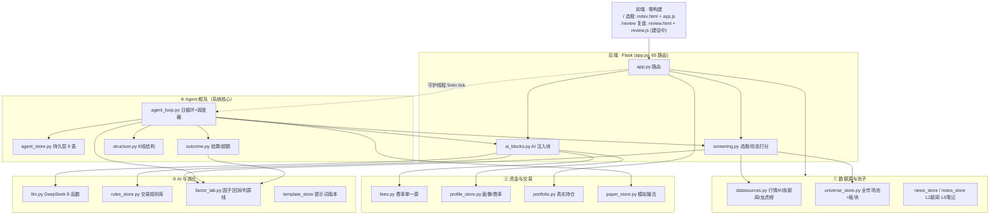
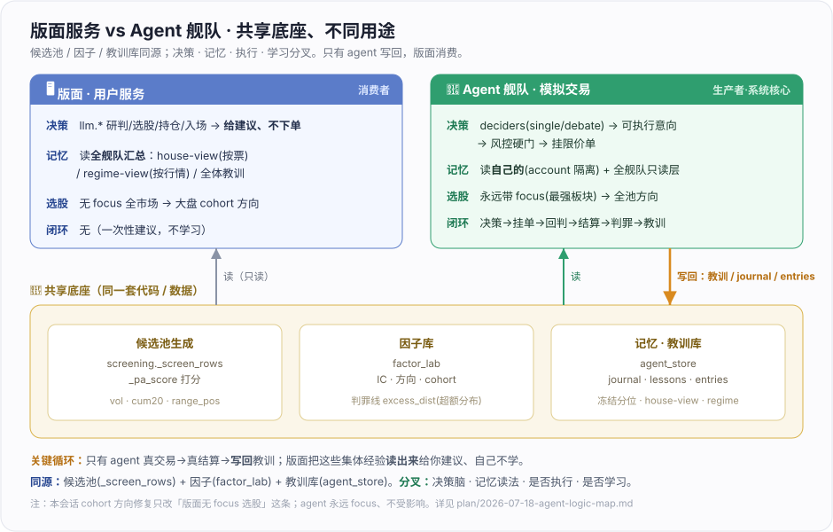

# A股观察台 · 系统框架 (framework.md)

> **一页看懂整套系统的结构、数据流、和知识在哪。** 这是知识库的**总入口/导航**——
> 只讲框架与去向，深度细节各归其档（见 §5「知识库地图」）。改代码前先读 `plan/PITFALLS.md`。

## 0. 知识库在哪（先答这个）

**没有单独的「知识库」目录——知识就活在仓库里**，分五类：

| 想要 | 去哪 |
|------|------|
| 上手 / 会话交接 / 机制速查 / 当前状态 | 根 `CLAUDE.md`（**权威开发文档**） |
| 用户面功能说明（对外） | 根 `README.md` |
| 各特性详细设计 · 踩坑 · 待办 | `plan/`（`README.md` 索引 · `PITFALLS.md` 改前必读 · `BACKLOG.md` 卡数据源） |
| **agent 核心逻辑权威地图** | `plan/2026-07-18-agent-logic-map.md`（系统核心/量化基座） |
| 可执行的契约（离线单测） | `tests/`（13 文件，零依赖离线） |
| 跨会话记忆（Claude 用，**不在仓库**） | `~/.claude/projects/…/memory/` |

本 `framework.md` = 上面这些的门面。**未接 Obsidian vault**——知识库=仓库本身。

## 1. 一句话定位

**本地运行**的 A 股看板 + 一支 **20 个 AI agent 的模拟交易舰队**。纯本地 Flask 后端代理各数据源，
前端零构建（HTML+CSS+原生 JS）。两个消费面：**用户看盘/深挖/选股**，和**自主 agent 攒真实交易数据**——
后者是系统核心，后续量化都基于它。

**两个前端路由**（本会话新增分栏）：`/` = **选股自动化**（原看板）· `/review` = **复盘自动化模块**
（A股短线情绪复盘，**建设中**：情绪硬指标 + DeepSeek 研判 + 可发布文稿）。二者共用底座数据/DeepSeek、
独立页面、顶部切换、不共用主页。

## 2. 架构分层

**分层职责**（文件 → 一句话；详见 `CLAUDE.md`「文件地图」）：

| 层              | 文件                                                                                                                     | 职责                                       |
| -------------- | ---------------------------------------------------------------------------------------------------------------------- | ---------------------------------------- |
| **入口**         | `app.py` · `templates/index.html` · `static/app.js`                                                                    | Flask 65 路由 · 选股 UI + 复盘 UI(/review, 建设中)            |
| **共享辅助**       | `screening.py` · `ai_blocks.py`                                                                                        | 选股/形态打分（cohort 方向）· 5 AI + agent 的注入块    |
| **① 数据**       | `datasources.py` · `universe_store.py` · `universe.py` · `news_store.py` · `notes_store.py` · `store.py` · `config.py` | 行情/K线/财报/新闻 + 全市场池+板块 + 自选/配置            |
| **② 资金交易**     | `fees.py` · `profile_store.py` · `portfolio.py` · `paper_store.py`                                                     | 费率单一源 · 多档画像 · 真实持仓(lot) · 模拟撮合          |
| **③ AI 进化**    | `llm.py` · `template_store.py` · `provenance.py` · `rules_store.py` · `ai_cache.py` · `websearch.py`                   | DeepSeek · 提示词版本化 · 溯源校验 · 规则库 · 缓存 · 联网 |
| **④ Agent 核心** | `agent_loop.py` · `agent_store.py` · `factor_lab.py` · `outcome.py` · `structure.py`                                   | 日循环+调度 · 持久层 · 因子/判罪线 · 结算 · K线结构        |

## 3. 两条主数据流

**A · 用户看盘**：前端请求 → `app.py` 路由 → `datasources`/`universe_store`/`portfolio` 取数
→（深挖/选股时）`ai_blocks` 拼注入块 + `llm` 调 DeepSeek（结果落 `ai_cache` 带时间戳）→ 前端内联 SVG 渲染。

**B · Agent 自主交易**（系统核心，详见 `plan/2026-07-18-agent-logic-map.md`）：
守护线程每 5min tick → `agent_loop.run_all` 过三道门（交易日/时段/原子占位）→ 每 agent `run_day` 九步
（结算旧仓 → 研判 → 选股 → 决策 LLM → 风控硬门 → 挂限价单 → 复盘记教训）→ 挂单下个 tick 回判成交
→ 建仓 5/10/20 日按超额结算、底部十分位判罪 → 教训+战绩喂回下次决策。

**A 与 B 什么关系？——共享底座、不同用途**（关键：只有 agent 写回，版面消费）：

- **同源**：候选池 `_screen_rows`/`_pa_score`（vol·cum20·range_pos）+ 因子库 `factor_lab`（IC/方向/判罪线）+ 记忆教训库 `agent_store`。
- **分叉**：① **决策脑**——版面 `llm.*` 给建议、不下单；agent `deciders` 出可执行意向→风控→挂单。
  ② **记忆读法**——版面读**全舰队汇总**（house-view/regime-view/全体教训）；agent 读**自己的**（account 隔离）+ 全舰队只读层。
  ③ **选股路径**——agent 永远带 focus（全池方向）；版面无 focus 全市场走大盘 cohort 方向（本会话 cohort 修复只动这条）。
  ④ **学习闭环**——只有 agent 真交易→真结算→写回教训；版面是**消费者**、自己不学。

## 4. 关键设计取向（跨层的约定）

- **红涨绿跌**（A股惯例）· 所有 AI 输出标「参考信号，不构成投资建议」· 前端零外部依赖、图纯内联 SVG。
- **判罪看超额收益（扣 beta）、无分布不判罪、决策不可补跑**——见 agent 地图 §14 十四条红线。
- **数据源优先腾讯/新浪（不封 IP），东财走限流且已按端点封 IP**——见 `PITFALLS.md`。
- **凡拍脑袋的阈值方向大概率错、能验必验**——已被数据打脸多次（`PITFALLS#1`）。

## 5. 知识库地图（想找什么去哪）

| 我想… | 看 |
|-------|-----|
| 快速上手 / 知道当前状态和待办 | `CLAUDE.md` |
| 理解 agent 怎么交易和学习（**最核心**） | `plan/2026-07-18-agent-logic-map.md` |
| 改代码前避雷 | `plan/PITFALLS.md` |
| 某个特性怎么设计的 | `plan/README.md` → 对应设计文档 |
| 卡在哪、待办 | `plan/BACKLOG.md` + `CLAUDE.md`「下一步」 |
| 数据接口怎么调 | `datasources.py` + `a-stock-data` skill |
| 钱怎么算（费率/盈亏/撮合） | `fees.py`/`portfolio.py`/`paper_store.py` + 对应单测 |
| 因子/判罪线 | `factor_lab.py` + `plan/2026-07-18-outcome-driven-lessons-design.md` |
| 后续量化从哪接 | agent 地图 §12「量化接入点」 |

---
> 维护：本文只随**架构层级变化**更新（加/删一个模块层、改数据流骨架）；细节漂移记进 `CLAUDE.md`/`plan/`，别在这重复。
