# A股观察台 · 系统框架 (framework.md)

> **一页看懂整套系统的结构、数据流、和知识在哪。** 这是知识库的**总入口/导航**——
> 只讲框架与去向，深度细节各归其档（见下方「想找什么去哪」表）。改代码前先读 `plan/PITFALLS.md`。

## 0. 知识库在哪（想找什么去哪）

**没有单独的「知识库」目录——知识就活在仓库里**，本 `framework.md` 是它的门面
（未接 Obsidian vault，知识库=仓库本身）：

| 想找什么 | 去哪 |
|------|------|
| 上手 / 会话交接 / 机制速查 | 根 `CLAUDE.md`（**权威开发文档**） |
| 用户面功能说明（对外） | 根 `README.md` |
| 理解 agent 怎么交易和学习（**最核心**） | `plan/2026-07-18-agent-logic-map.md` |
| 改代码前避雷 | `plan/PITFALLS.md` |
| 某个特性怎么设计的 | `plan/README.md`（索引）+ 对应设计文档 |
| 卡在哪、待办 | `plan/BACKLOG.md` |
| 数据接口怎么调 | `datasources.py` + `a-stock-data` skill |
| 钱怎么算（费率/盈亏/撮合） | `fees.py` / `portfolio.py` / `paper_store.py` + 对应单测 |
| 因子/判罪线 | `factor_lab.py` + `plan/2026-07-16-outcome-driven-lessons-design.md` |
| 后续量化从哪接 | agent 地图 §12「量化接入点」 |
| 可执行的契约（离线单测） | `tests/` 零依赖离线；文件清单与断言数见 `python3 tools/status.py` |
| 跨会话记忆（Claude 用，**不在仓库**） | `~/.claude/projects/…/memory/` |

## 1. 一句话定位

**本地单人运行、也可部署为服务器多人共用**的 A 股看板 + 一支 **20 个 AI agent 的模拟交易舰队**。
Flask 后端代理各数据源，前端零构建（HTML+CSS+原生 JS）。三个消费面：**用户看盘/深挖/选股**、
**自主 agent 攒真实交易数据**（系统核心，后续量化都基于它）、**多用户登录与按人隔离**（登录、
每人一份数据、AI 日预算，服务器 gunicorn+scheduler 拓扑）。

**两个前端路由**：`/` 选股看板 · `/review` 复盘（A股短线情绪复盘：情绪硬指标 + DeepSeek 研判 +
可发布文稿，收盘后自动生成）。二者共用底座数据/DeepSeek、独立页面、顶部切换、不共用主页。
`review/` 包 = fetch/metrics/store/llm_review/pipeline/run_daily/backfill。

## 2. 架构分层

```mermaid
flowchart TB
  UI["前端 · 零构建<br/>/ 选股: index.html + app.js<br/>/review 复盘: review.html + review.js<br/>登录: login.html"]
  subgraph BE["后端 · Flask"]
    APP[app.py 路由]
    SCR[screening.py 选股/形态打分]
    AIB[ai_blocks.py AI 注入块]
    AUTH[auth.py 登录闸门]
    UC[userctx.py 按人隔离]
    RT[ratelimit.py 限流/AI 日预算]
  end
  subgraph PICK["三周期选股与观点账本"]
    PLV[picks_levels.py 候选价位]
    PST[picks_store.py 观点账本]
    PPL[picks_pipeline.py 候选池/运行/结算]
    PRT[picks_routes.py /api/picks]
    LLP[llm_picks.py 提示词与校验]
  end
  subgraph DATA["① 数据源与池子"]
    DS[datasources.py 行情/K线/新闻/龙虎榜]
    US[universe_store.py 全市场池+板块]
    NS[news_store / notes_store L2新闻·L5笔记]
  end
  subgraph MONEY["② 资金与交易"]
    FEE[fees.py 费率单一源]
    PROF[profile_store.py 画像/费率]
    PORT[portfolio.py 真实持仓]
    PAPER[paper_store.py 模拟撮合]
  end
  subgraph AIL["③ AI 与进化"]
    LLM[llm.py DeepSeek 调用]
    RULES[rules_store.py 交易规则库]
    FL[factor_lab.py 因子回测/判罪线]
    TPL[template_store 提示词版本]
  end
  subgraph AGENT["④ Agent 舰队（系统核心）"]
    AL[agent_loop.py 日循环+调度器]
    AS[agent_store.py 持久层]
    OUT[outcome.py 结算/超额]
    STR[structure.py K线结构]
  end
  subgraph PROC["多用户与进程拓扑"]
    WSGI[wsgi.py gunicorn 入口]
    SCH[scheduler.py 独立调度进程]
  end
  UI --> APP
  APP -. "before_request 闸门" .-> AUTH
  AUTH --> UC
  APP --> RT
  APP --> SCR & AIB & DATA & PORT
  SCR --> DS & US & FL
  AIB --> LLM & RULES & PROF & FEE
  APP --> PRT
  PRT --> PPL & PST
  PPL --> LLP & PLV & DS & US
  APP -. "守护线程 5min tick" .-> AL
  AL --> AS & OUT & SCR & AIB & PAPER & FL & STR
  OUT --> FL
  WSGI --> APP
  SCH -. "公共预热/复盘/清理" .-> DS
  SCH -. "三周期选股定时批" .-> PPL
```

文件到职责的完整地图见 `CLAUDE.md`「文件地图」。

### 2.1 进程拓扑

- 本地：`python3 app.py` 单进程，登录后使用，开着就自动跑盘中调度与每日复盘。
- 服务器：gunicorn（`wsgi.py` 入口）+ `scheduler.py`（公共预热、复盘、每日清理，还跑三周期选股定时批）
  + tailscale 终止 TLS；agent 默认不自动跑。

机制细节在 `CLAUDE.md`「多用户与部署」节，部署步骤在 `deploy/README-deploy.md`。

## 3. 两条主数据流

**A · 用户看盘**：前端请求到 `app.py` 路由，经 `datasources`/`universe_store`/`portfolio` 取数；
深挖/选股时 `ai_blocks` 拼注入块、`llm` 调 DeepSeek（结果落 `ai_cache` 带时间戳），前端内联 SVG 渲染。

**B · Agent 自主交易**（系统核心，详见 `plan/2026-07-18-agent-logic-map.md`）：
守护线程每 5 分钟 tick，`agent_loop.run_all` 过三道门（交易日/时段/原子占位），每个 agent `run_day`
依次研判、选股、决策 LLM、风控硬门、限价挂单、复盘（确定性失败检测）；挂单在下个 tick 回判成交，
建仓 5/10/20 日按超额结算、底部十分位判罪，教训与战绩喂回下次决策。

**A 与 B 什么关系？——共享底座、不同用途**（关键：只有 agent 写回，版面消费）：

- **同源**：候选池 `_screen_rows`/`_pa_score`（vol·cum20·range_pos）+ 因子库 `factor_lab`（IC/方向/判罪线）+ 记忆教训库 `agent_store`。
- **分叉**：1) **决策脑**——版面 `llm.*` 给建议、不下单；agent `deciders` 出可执行意向，经风控后挂单。
  2) **记忆读法**——版面读**全舰队汇总**（house-view/regime-view/全体教训）；agent 读**自己的**（account 隔离）+ 全舰队只读层。
  3) **选股路径**——agent 永远带 focus（全池方向）；版面无 focus 全市场走大盘 cohort 方向。
  4) **学习闭环**——只有 agent 真交易、真结算、再写回教训；版面是**消费者**、自己不学。

## 4. 关键设计取向（跨层的约定）

- **红涨绿跌**（A股惯例）· 所有 AI 输出标「参考信号，不构成投资建议」· 前端零外部依赖、图纯内联 SVG。
- **判罪看超额收益（扣 beta）、无分布不判罪、决策不可补跑**——见 agent 地图 §14 十四条红线。
- **数据源优先腾讯/新浪（不封 IP），东财走限流且已按端点封 IP**——见 `PITFALLS.md`。
- **凡拍脑袋的阈值方向大概率错、能验必验**——已被数据打脸多次（`PITFALLS#1`）。

---

> 维护：本文只随**架构层级变化**更新（加/删一个模块层、改数据流骨架）；细节漂移记进 `CLAUDE.md`/`plan/`，别在这重复。
