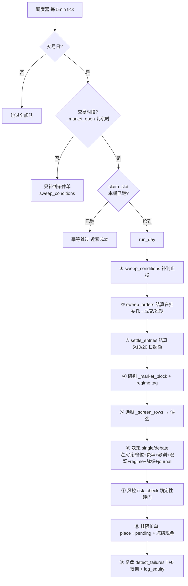
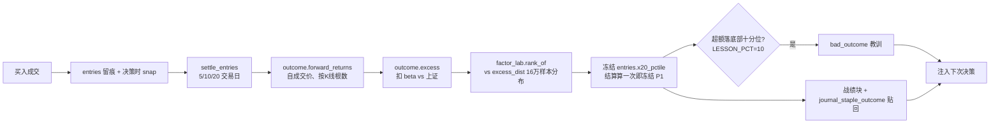

# Agent 逻辑地图（权威·运行时全景，2026-07-18）

> **这是系统的地基**：模拟盘 agent 的交易/学习闭环。后续所有量化都建立在这套之上（量化接入点见 §11）。
> 与散落的 CLAUDE.md「关键机制速查」互补——那里是速查条目，这里是**端到端如何跑通**的完整链路。
> 设计缘由分见 `plan/2026-07-16-agent-evolution-design.md`（总设计）· `-outcome-driven-lessons-design.md`（判罪）·
> `-decision-data-plane-design.md`（决策数据面）· `2026-07-18-agent-memory-redesign.md`（记忆 P1–P3）·
> `2026-07-17-intraday-agent-scheduler-design.md`（调度器）。行号以本文成文时为准，改代码后以代码为准。

## 0. 10 秒心智模型

一支 **20 个 agent 的舰队**，每个绑一个独立**模拟盘账户** + 一个**投资画像**（决定档位/费率）。
交易日的两个**时段桶**（早盘/尾盘），调度器让每个 agent 各跑一次 `run_day`：
**先结算旧仓与在挂委托 → 研判大盘 → 选股 → 决策（LLM，可 single/debate）→ 确定性风控硬门 → 挂限价单 → 复盘记教训**。
挂单不即时成交，靠下一个 tick 用分时/日K**回判**是否触及。建仓留痕 5/10/20 交易日后按**超额收益**结算，
落在历史分布**底部十分位**才「判罪」记教训。教训 + 自己的战绩/决策日志**喂回**下一次决策 = 学习闭环。

## 1. 舰队与账户模型

- **agent**（`agent_store.agents`）：`name` + `account_id`（绑定的模拟盘账户）+ `profile_id`（投资画像）+ `decider`（single/debate）+ active。当前 20 个，覆盖 微型→超大 × 稳健/均衡/激进 × single/debate（见 CLAUDE.md）。
- **账户隔离**：每个 agent 只看自己 account 的持仓（`paper_store` 按 account_id）、只召回自己的教训与战绩、只读自己的 journal。**这是多-agent 对照实验的干净前提**——A 表现好不能是因为偷读了 B 的教训。
- **画像跟钱走、费率跟券商走**（`ai_blocks._agent_blocks`）：档位按**这个 account 的总资产**落档，费率按 agent 绑的 profile（同券商则共用合理）。修过「50 万的中型 agent 拿到用户 7000 块微型档」的 bug。

## 2. 日循环 pipeline（`run_day` 精确顺序）

`agent_loop.run_day(agent_id, dry_run, force, slot)`（`agent_loop.py:802-968`）。顺序**有依赖、不可乱**：

| # | 步骤 | 函数 | 关键点 |
|---|------|------|--------|
| ① | 补判条件单 | `sweep_conditions` | app 关闭期间可能已触发的止损，先用日K补判 |
| ② | 结算在挂委托 | `sweep_orders` | **必须在决策前**（否则 AI 基于未结算持仓重复下单） |
| ③ | 建仓留痕结算 | `settle_entries` | 走日K，与当前时段无关；只算超额、只判罪够格的 |
| ④ | 研判大盘 | `_market_block` | 指数+K线结构+涨停跌停+板块强弱；顺带算 `_mkt_regime` tag |
| ⑤ | 选股 | `screening._screen_rows` | 复用用户面选股；agent 永远带 focus（最强板块）→ 全池方向打分 |
| ⑥ | 决策 | `DECIDERS[decider]` | single 或 debate；注入链见 §5 |
| ⑦ | 风控 | `risk_check` | 每个 intent 过确定性硬门（§6） |
| ⑧ | 挂单 | `agent_store.place` | 挂限价单进 pending、冻结现金；买入入 journal |
| ⑨ | 复盘 | `detect_failures` + `log_equity` | T+0 确定性失败检测记教训；记净值 |

dry_run 在 ⑧ 只记不下单（§8），⑨ 的 journal「观望」记录也 `if not dry_run` 跳过。

## 3. 三道门 + 调度器

**门在两个函数**：`run_all` 持 (a)(b)，`run_day` 持 (c)。一个 tick 进 `run_all(require_open=True)` 扇出到每个 agent 的 `run_day`。

- **(a) 非交易日**（`run_all:988`）：`news_store.is_trading_day()`（周末/动态节假日）→ 全舰队短路。`force` 绕过。
- **(b) 交易时段 `require_open`**（`run_all:995-1007`）：`_market_open()`（`agent_loop:81-96`，**北京时** `Asia/Shanghai`，9:30–11:30 或 13:00–15:00 **含端点**）。非时段 → **只 `sweep_conditions` 补判、跳过决策**（省掉每 agent 一次 v4-pro）。
- **(c) `claim_slot` 原子占位**（`run_day:816-819` → `agent_store.claim_slot:549-563`）：`INSERT claims` PK`(agent_id,date,slot)`，冲突→False。**原子、无「查-写」窗口**——修过两个并发 `run_all` 都溜过去、10:19:58 与 10:20:08 各跑一遍的真 bug。跑失败 `release_slot` 释放、下次可重试；成功则占住 = 当日该桶幂等。

**时段桶（slot）**：`SLOTS`（`agent_loop:65-68`）= 早盘 9:30–11:30 / 尾盘 13:00–15:00。11:30–13:00 午休不是桶。`current_slot()` 非时段返回 `""`；off-session 手动/dry 跑得 slot `"手动"`。

**错过不补**（`agent_loop:60-64`）：漏掉的桶**永不补跑**——补跑要重建当时的信息环境（全市场快照/板块/资金流），但 `sina_all_stocks()` 只有**当前**快照、无 as-of 参数，任何泄漏 → AI 用 14:00 的数据答 10:00 的题 → 系统性过度乐观且不可审计。真交易员也补不了。**对比**：条件单/限价单**能**回判（「跌破止损价」「触及限价」是**既成事实**、不需重建上下文）。

**调度器**（`app.py`）：`_AGENT_TICK_SEC=300` → **每 5 分钟一 tick**。`_agent_scheduler`（守护线程，启动即跑一次，再 `while sleep(300)`）。`_agent_tick` **单飞** `_agent_tick_lock`（占用则跳过——一轮舰队 workers=3 要 7–20 min，防重叠堆叠并发被限流）。**两层幂等**：tick 锁防重叠 + `claim_slot` 防同桶顺序重跑（多余 tick 近零成本）。**存在意义**：修「非交易时段开 app → 当天决策永不触发」——现在任何时刻开 app，每个交易桶到点各跑一次。

## 4. 决策数据面（喂给 AI 的原料）

- **`_market_block`**：五大指数点位 + 上证/创业板 K线结构摘要（MA5/20/60、近20日高低、最近3根 OHLC）+ 涨停/跌停净数 + 板块强弱前5。**只给原料不下结论**——趋势由 AI 读均线自己判。规则库 84 条里 37 条要 K线，原先一条都没给（曾致 8/12 agent 报「无法判断市场」而拒手）。
- **候选股 + 持仓的日K结构**（`structure.fmt_stock`）：每只候选带均线/高低/最近3根，让提示词能满足它自己注入的规则。
- **regime tag**（`_regime_tag`）：粗粒度 `趋势/情绪`（up/down/flat × hot/cold/neutral，~9 桶），journal 按它检索「同类行情」。

## 5. 决策层（可插拔 decider + 注入链）

**两种 decider**（`DECIDERS`，`agent_loop:173-176`）：
- **`single`**（`_single_decider:113-122`）：一次 LLM，`max_tokens=8000`（DeepSeek 推理模型，token 覆盖思考+正文，太小会思考耗尽正文空）。
- **`debate`**（`_debate_decider:124-171`）：多头/空头**并行**论证（各 `max_tokens=8000`）→ 裁判定夺（`max_tokens=12000`，上下文最长）。**单边失败必须炸掉整个辩论**（不许降级成一面之词——那样系统性偏空且无人察觉）。默认不启用，先用 single 拿基线。

**注入链**（`_decide_prompt:356-402` 把 `ctx['blocks']` + 大盘 + 候选 + 持仓拼成 prompt）。`ctx['blocks']` = `_agent_blocks`（`ai_blocks:108-130`）+ 战绩块 + journal 块：
1. `_tier_block` 本金玩法档（按 account 总资产）
2. `_fee_block` 交易成本（具体费率 + 保本涨幅，按 profile）
3. `_lesson_block(agent_id)` **自己的**教训（个体记忆）
4. `_lesson_block()` **全舰队**教训只读层（市场真理该共享，标签区分「你本账户」vs「全体」→ 不趋同）
5. `rules_store.for_ai()` 交易规则库
6. `_agent_history_block` **你的近期战绩**（自己的建仓+20日超额+冻结分位，account 隔离）
7. `_agent_journal_block` **你最近的决策与理由**（当时写下的原话 + 结果，情节记忆）

> **红线**：战绩/journal **只喂事实原话，不让 agent 写事后反思**——反思=5 样本拟合噪音（设计文档红线），且无法客观校验。

## 6. 风控硬门（`risk_check:435-457`，全确定性、无 LLM）

**卖**：S1 未持有→拒；S2 `shares > sellable`（T+1 锁定）→拒。
**买**（`amount = shares × limit_price`）：B0 `amount≤0`；B1 现金不足（`amount+fee > cash`）；B2 买后现金% < `MIN_CASH_PCT(10)`；B3 仓位% > `MAX_POS_PCT(30)`；B4 `vol > MAX_VOL(120)`。

**分散在别处的硬门**（写文档/改动时别漏）：
- **整手**：`paper_store.order:150`（买入 `shares%100`）。
- **涨跌停**：`paper_store.order:165-169`（涨停买不到/跌停卖不出）。
- **T+1**：双重——`risk_check` S2 + `paper_store` 卖路径 + `_settle` 置 `sellable`（`lock_date<today` 才可卖，当日买入 `lock_date=today`）。
- **VOL_FLOOR/CEIL=15/130**：**选股门**（`screening._pa_score:106`），不是 risk_check。⚠️ 不对称：选股放行 vol≤130，但 risk_check 拒 vol>120 → 120–130 的候选会出现却被风控拒。
- **保本涨幅**：**不是硬拒**——只在提示词提示 + 卖出后 `below_breakeven` 教训。

## 7. 订单生命周期（限价单，当日有效）

`place()`（`agent_store:580-595`）→ `pending` 表 `status='live'`，存 `limit_price/shares/placed_t/reason/`**`snap`**（决策时属性快照，买入才有——**必须挂单时抓**，成交在后续 sweep 循环、`ctx` 已不存在，重取会读到变了的值=未来函数）。挂单**不即时成交**；现金**in-round 冻结**（`run_day:936-939` 只扣内存 `ctx['cash']` 防同轮超额占用，paper.db 成交才真扣）。

`sweep_orders:738-787`（必在决策前）→ `_touched:600-628` 判触及：**当日**用分时（首个 `price≤limit` 买/`≥limit` 卖）；**隔夜**用日K（`low≤limit` 买/`high≥limit` 卖）。**成交价锁 limit、不取更优**（分时只有分钟收盘，假设更优会系统性高估）。成交 → `paper_store.order`（`market_open=True` 硬编，回判事实非 live）。**买入成交副作用**：自动挂止损 `px×0.90` + `add_entry` 建仓留痕（用挂单时 snap）。**卖出成交**：`cancel_conditions`。**当日有效**：未触及且非当日 → `expired` 自动撤单。

## 8. 条件单 / 止损（`sweep_conditions:531-596` + `conditions` 表）

- **止损是纪律不是预测**：买入成交即挂 `px×(1+STOP_LOSS_PCT/100)=px×0.90`（`STOP_LOSS_PCT=-10`）。**回测 108,139 样本定**（`backtest_stops`）：无止损均值最高 +1.94% 但尾部 −17.66%；−10% 花 0.27pp 均值封住尾部至 −10%、触发率 33.6%；−5% 太紧（60% 被扫）、−15/−20 被支配。**纪律参数**。
- **日K回判**（app 关闭期无 live 报价，但日K记录真实高低，「某日 low≤止损价」是真触发）。**止损优先于止盈**（同日不知盘中序，保守）。成交价锁 `trigger_price`。仅**真亏**（`ret<0`）记 `loss_cut_late`（止损在成本上方是保护性止盈、不算迟滞）。

## 9. 结算与判罪（学习闭环的「真理层」）

**分工**：`outcome.py`=纯结算数学（零 IO）· `factor_lab.py`=历史分布/判罪线 · `agent_store`=持久化。

- **`settle_entries:686-735`**「只算不判罪」：每笔 open entry 5/10/20 交易日后算超额；**幂等**（r5 先到、r20 后到都反复扫，20 日档出齐才落 `settled_at`、此后不再扫）。
- **`outcome` 公式**：`forward_returns` 自**成交价**、按**K线根数**数交易日（不数日历日，防跨周末错位）；`bench_returns` 按个股 +h 根那天的**日历日期**对齐基准（签名收 `end_dates` 而非 horizons → 「两边各数 h 根」的 bug 不可表达；踩过：停牌致超额高估 10 个百分点）；`excess=stock−bench`，任一 None→None（不回退绝对收益，否则把 beta 当能力=PITFALLS 红线）。基准 `sh000001`，与判罪线**同基准**（单一事实源）。
- **判罪线**：`excess_dist`（backtest 顺带产出的超额分位分布，`DIST_PCTS=(1,5,10,25,50,75,90,95,99)`）是**唯一合法来源**；`rank_of` 值→分位，**无分布返回 None、绝不猜**（PITFALLS#1）。`LESSON_PCT=10` 底部十分位=判罪线，**纪律参数**（16 万样本是事实，「取底 10%」是选择，需用户认可）。**「超额<0=失败」是错的**：实测 p50(20日)=−0.90%（个股跑输市值加权指数是常态）→ 会判 53% 为失败、教 AI「你几乎总失败」。判 `JUDGE_H=20`（5 日 vs 20 日 33.1% 判反）。
- **冻结分位 P1**：`entries.x20_pctile` 结算这一刻算一次即冻结，战绩块/journal/`_judge_entry` 都**读它、永不重算** → 同一笔过去交易分位恒定、不随分布刷新漂移（修「记忆总是变动」）。

**两条教训路径**（关键区分，别混）：
1. **`detect_failures:461-527`（T+0 确定性）**：扫**真成交**，`bad(factor)` 门（`factor_lab.directions()` sign<0 才记 → 不惩罚 AI 服从自己的 IC 正因子）。记 9 类即时教训：`chase_high`(range_pos>85)、`high_vol_entry`(vol>96)、`against_sector`(板块<-1%)、`below_breakeven`、`cash_exhausted`、`loss_cut_late`、`stale_hold`、`oversize`（+`rule_violation`）。
2. **`_judge_entry:654-683`（结果导向）**：20 日结算后，仅超额落**底部十分位**记 `bad_outcome`（个案非规律）。
教训闭集 `LESSON_KINDS` 10 类（`agent_store:38-55`）；`add_lesson` UPSERT`(agent_id,kind,code)` **累加 hits 不加行**（表稀疏、永久保留）；`lessons()` 按 hits DESC（最常犯=最该注入）。

## 10. 记忆系统（P1–P3 + regime-view，共享底座「一份 journal、多个视图」）

- **底座 = `agent_store.journal` 表**（append-only、永不回改 → 结构上不「变动」）。每次决策（买/观望）入一行：`regime` tag + `signals` 快照 + `action` + **`summary`=当时写下的理由原话**（买 reason / 观望 skip_reason，**零新增 LLM**）；结算贴 20 日超额 + 冻结分位（`journal_staple_outcome`，一次性幂等）。
- **视图**（都从 journal/lessons 确定性检索）：
  - `_agent_journal_block(agent_id)` — 交易 agent 自己近 8 条决策+理由+结果（连续性）
  - `_agent_history_block(agent_id)` — 自己的建仓战绩（已结算带超额+冻结分位 / 持有中）
  - `_lesson_block(agent_id)` 自己教训 + `_lesson_block()` 全舰队只读层（P3）
  - `_stock_house_view(code)` — 用户面深挖/持仓，全舰队对这只票的历史看法（P2c）
  - `_regime_view(regime)` — 大盘研判/选股 AI 按「同类行情」回看全舰队战绩（P3 收尾）
- ⏳ **未做**：舰队→提示词提炼（D，用户最终目标，等教训库有数据）。

## 11. 数据模型（`agent_store` 表一览）

| 表 | 职责 | 保留 |
|----|------|------|
| `agents` | agent 配置（account/profile/decider） | 永久 |
| `runs` | 日循环流水（研判/选股/决策… 原文 detail） | 原文 90d / 行 365d |
| `lessons` | 教训闭集（hits 累加，注入 AI） | 永久 |
| `pending` | 在挂限价单（live/filled/expired/cancelled + snap） | — |
| `conditions` | 止损/止盈条件单 | — |
| `claims` | 时段桶原子占位（幂等门） | — |
| `equity` | 每日净值 | 730d |
| `entries` | 建仓留痕 + 结算结果 + **冻结分位 x20_pctile** | 永久 |
| `journal` | 情节记忆（append-only，决策+理由+结果） | 永久 |

（另：`paper_store`=模拟撮合账户/持仓 · `factor_lab`=ic_daily/ic_cohort/excess_dist · `profile_store`=画像/费率。）

## 12. 量化在哪里接入（后续工作的挂载点）

这套架构对「LLM 决策」和「量化决策」是**同一套骨架**——只有 §5 的 decider 换人，其余（门/调度/风控/订单/结算/判罪/记忆）全部复用。量化的自然接入点：

1. **因子层（`factor_lab`）**——预测信号的家。当前 3 因子（vol/cum20/range_pos，等权，cohort-aware 方向）；扩因子、改权重、改 cohort 定向都在这里。`net20` 资金因子卡在数据源（只 30 天）。
2. **选股打分（`screening._pa_score`）**——量化信号排候选、决定谁进 AI 的名额。
3. **新 decider**——在 `DECIDERS` 注册一个**纯规则/量化 decider**（不调 LLM），与 single/debate 走**同一张归因表** → 可直接 A/B。这是把量化策略塞进舰队最干净的方式。
4. **风控/仓位（`risk_check` + `backtest_stops`）**——仓位 sizing、止损网格已有回测基建。
5. **评判层（`outcome` + `excess_dist`）= 通用测量尺**：**任何**策略（LLM 或量化）都被同一套「超额 vs 历史分布」判罪。这是量化最该复用的资产——别自建评判，套这把尺子结论才可比。

> 一句话：**量化 = 在 §1/§2/§4/§6 已有的骨架里，把 §5 的决策脑和 §9 的因子换成/补上你的模型，用 §9 同一把尺子评判。**

## 13. 关键常量速查

| 常量 | 值 | 处 | 性质 |
|------|-----|----|------|
| `SLOTS` | 早盘 9:30–11:30 / 尾盘 13:00–15:00 | agent_loop:65 | 纪律 |
| `_AGENT_TICK_SEC` | 300（5min） | app:1172 | 工程 |
| `HORIZONS` / `JUDGE_H` | (5,10,20) / 20 | factor_lab:46 | 对齐评估 |
| `BENCH_SYM` | sh000001（上证） | factor_lab:50 | 单一事实源 |
| `LESSON_PCT` | 10（底部十分位判罪） | agent_loop:215 | **纪律·需用户认可** |
| `STOP_LOSS_PCT` | −10（px×0.90） | agent_loop:58 | 纪律·已回测 |
| `LOSS_CUT_PCT` | −12 | agent_loop:53 | 纪律 |
| `STALE_DAYS` | 20 | agent_loop:52 | 纪律 |
| `CHASE_HIGH_POS` | 85 | agent_loop:48 | 纪律·教训门 |
| `MAX_POS_PCT` / `MIN_CASH_PCT` | 30 / 10 | agent_loop:49-50 | 风控硬门 |
| `MAX_VOL` | 120（年化波动上限） | agent_loop:51 | 风控硬门 |
| `VOL_FLOOR/CEIL` | 15 / 130 | screening:28-29 | 选股门 |
| 费率 | 万2.5 + 5元最低 + 印花千0.5(卖) + 过户万0.1 | fees:30-33 | 存画像 |

## 14. 不变量 / 红线（改动前必守）

1. **判罪必看超额、不看绝对收益**——扣 beta，否则大盘涨时随便买都「成功」（beta 污染）。
2. **无分布不判罪、不显著不定向**——`rank_of`/`direction` 返回 None 时调用方必须放弃，不许拍默认值（PITFALLS#1）。
3. **决策不可补跑**（重建信息环境必泄漏未来）；条件单/限价可回判（既成事实）。
4. **成交价一律取保守值**（锁 limit/trigger，不取当时更优）。
5. **幂等靠原子占位**（`claim_slot` PK），不靠「查有没有跑过」。
6. **教训只喂事实、不让 agent 写反思**；战绩/journal 同理。
7. **冻结分位结算算一次即冻**，读它不重算（记忆不漂移）。
8. **每个 agent 用自己的档位/费率/教训/journal**（account 隔离，多-agent 对照才干净）。
9. **改决策提示词/数据面后必实跑一个 debate 档**（token 预算最短板）。
